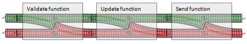

class: center, middle
# Real life Monads

--
On en fait déjà

--

Promise, Optional, ...

---
## Railway oriented programming
.left[]

### On débranche afin de laisser le reste du code rectiligne

---
## Maybe (Optional)
Chouette, supprime les 

```java
if (value == null) {
}
``` 
--

```Java
Project foundProject = projects.values().stream()
    .filter(project -> project.hasTask(taskId))
    .findFirst().get();

if (foundProject == null) {
    display.taskNotFound(taskId)
} else {
    foundProject.setDone(taskId, taskMarker, display)    
}

// Maybe::orElse even for side effects with Runnable
projects.values().stream()
		.filter(project -> project.hasTask(taskId))
		.findFirst()
		.<Runnable>map(project -> () -> project.setDone(taskId, taskMarker, display))
		.orElse(() -> display.taskNotFound(taskId))
		.run();
```

---
## Either (Promise)
Cool, mais le "Left" est un peu comme n'importe quel throws, avec plus de syntaxe...

``` javascript
Promise.reject()
   .catch(e => ...)
```

---
## Continuation (Promise, Future)

```javascript
Const promise = callToWebService()
promise.then(doSomething)
       .then(val => {
          // some code here
       })

```
---
## Autres monades
- Free
- Validation
- Identity
- IO
- Reader, Writer
- List

---
## Travaux pratiques
### Railway oriented programming 
http://fsharpforfunandprofit.com/posts/recipe-part2/

.left[]

### Monads in JS
- Functional Programming In JavaScript — With Practical Examples https://medium.freecodecamp.org/functional-programming-in-js-with-practical-examples-part-1-87c2b0dbc276

- THE MARVELLOUSLY MYSTERIOUS JAVASCRIPT MAYBE MONAD https://jrsinclair.com/articles/2016/marvellously-mysterious-javascript-maybe-monad/

---
### Exercise
#### Base de code
https://github.com/sandromancuso/trip-service-kata

#### Libs
http://www.vavr.io/

Monet js

---
## Solution js
https://gist.github.com/martinsson/0cc9c06f87357581bfcb24a293978926
